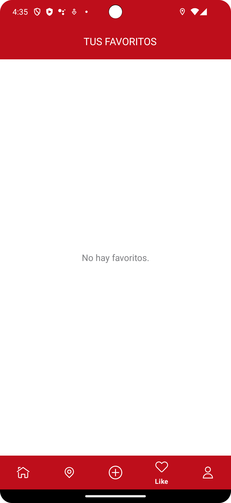
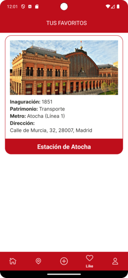

# MadridIndustria - Patrimonio Industrial de la Comunidad de Madrid

## FIGMA

## ESPAÑOL
MadridIndustria fomenta el interés en el patrimonio industrial de la Comunidad de Madrid. Con su interfaz intuitiva, explora y accede a información detallada sobre cada patrimonio, encuentra sitios históricos en el mapa, marca tus descubrimientos favoritos y organízalos en tu lista personal. Los gestores de patrimonios industriales pueden actualizar y gestionar la información, compartiendo datos relevantes para enriquecer la experiencia del usuario. ¡Descubre, aprende y preserva la historia industrial de Madrid con MadridIndustria!

### Ramas
- **Favorite**: Rama responsable de todo lo relacionado con Favorite.

### Actividades
- **Favorite**: Permite mostrar la lista de favoritos del usuario.

### Capturas
  

### Video Demostrativo
[Video de Favorite Activity](video/favorite.webm)

### Estilo
Hemos personalizado la apariencia de la aplicación usando estilos y temas definidos en `res/values/styles.xml`. Para más detalles, por favor revisa el código y comentarios en las actividades correspondientes.

### Contribuyendo
No dudes en contribuir a este proyecto creando solicitudes de extracción o informando problemas.

## ENGLISH
MadridIndustria promotes interest in the industrial heritage of the Community of Madrid. With its intuitive interface, explore and access detailed information about each heritage site, locate historic sites on the map, mark your favorite discoveries, and organize them in your personal list. Industrial heritage managers can update and manage information, sharing relevant data to enhance the user experience. Discover, learn, and preserve the industrial history of Madrid with MadridIndustria!

### Branches
- **Favorite**: Branch responsible for everything related to Favorite.

### Activities
- **Favorite**: Allows you to display the user's favorites list.

### Captures
  

### Demo Video
[Favorite Activity Video](video/favorite.webm)

### Style
We've customized the appearance of the application using styles and themes defined in `res/values/styles.xml`. For more details, please review the code and comments in the corresponding activities.

### Contributing
Feel free to contribute to this project by creating pull requests or reporting issues.
