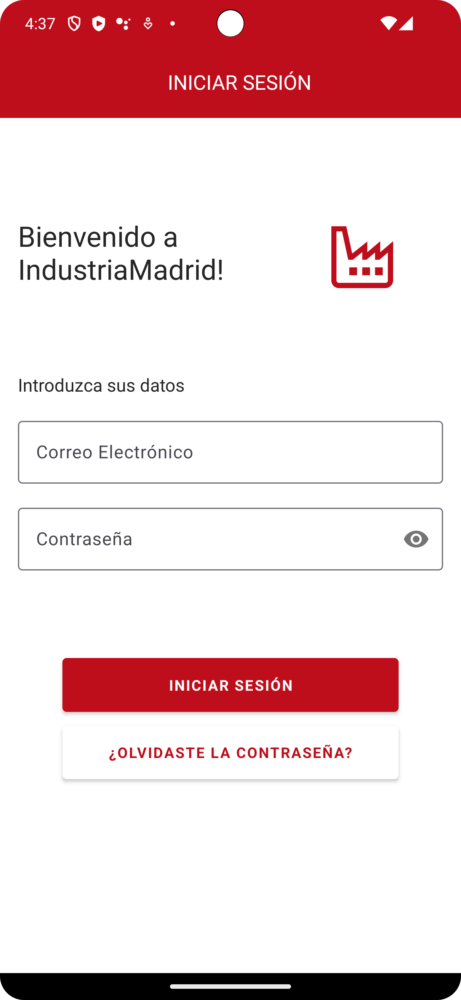

# MadridIndustria - Patrimonio Industrial de la Comunidad de Madrid

## FIGMA

## ESPAÑOL
MadridIndustria fomenta el interés en el patrimonio industrial de la  
Comunidad de Madrid. Con su interfaz intuitiva, explora y accede  
a información detallada sobre cada patrimonio, encuentra sitios históricos  
en el mapa, marca tus descubrimientos favoritos y organízalos en tu  
lista personal. Los gestores de patrimonios industriales pueden actualizar  
y gestionar la información, compartiendo datos relevantes para enriquecer  
la experiencia del usuario. ¡Descubre, aprende y preserva la historia  
industrial de Madrid con MadridIndustria!.

### Ramas
- **Register**: Contiene la funcionalidad del Hall de iniciar o registrarse,
Login permite incia la sesión de diferentes formas, al iniciar con tu correo
y por casualidad te olvidaste la contraseña te dirige a tu correo o si no al Hall.

### Actividades
- **HallActivity**: Aparece iniciar sesión y registrarse.
- **LoginActivity**: Permite Aceder por correo, apple, facebook o el correo electronico que te registraste.
- **RegisterActivity**: Permite a los usuarios registrarse.
- **PasswordActivity**: Permite insertar la contraseña o si te has olvidado contraseña.
- **Password2Activity**: Permite darte la opcion de enviarte la contraseña.

### Capturas

### Video Demostrativo
[Video General de la rama Register](video/login.webm)

### Estilo
Se personalizo la apariencia de la aplicación usando estilos y temas definidos en `res/values/styles.xml`.

### Contribuyendo
No dudes en contribuir a este proyecto creando solicitudes de extracción o informando problemas.

## ENGLISH
MadridIndustria promotes interest in the industrial heritage of the Community of  
Madrid. With its intuitive interface, explore and access detailed  
information about each heritage site, locate historic sites on the map,  
mark your favorite discoveries, and organize them in your personal list.  
Industrial heritage managers can update and manage information, sharing  
relevant data to enhance the user experience. Discover, learn, and preserve  
the industrial history of Madrid with MadridIndustria!

### Branches
- **Register**: Contains the Hall functionality of starting or registering,
Login allows you to log in in different ways, starting with your email
and by chance you forgot the password, it goes to your email or else to the Hall.

### Activities
- **HallActivity**: Login and register appears.
- **LoginActivity**: Allows you to log in by email, apple, facebook or the email you registered.
- **RegisterActivity**: Allows users to register.
- **PasswordActivity**: Allows you to insert the password or if you have forgotten the password.
- **Password2Activity**: Allows you to give yourself the option of sending you the password.

### Captures

### Demonstration video
[General Video of the Registration branch](video/login.webm)

### Style
We've customized the appearance of the application using styles and themes defined in `res/values/styles.xml`.  
For more details, please review the code and comments in the corresponding activities.

### Contributing
Feel free to contribute to this project by creating pull requests or reporting issues.