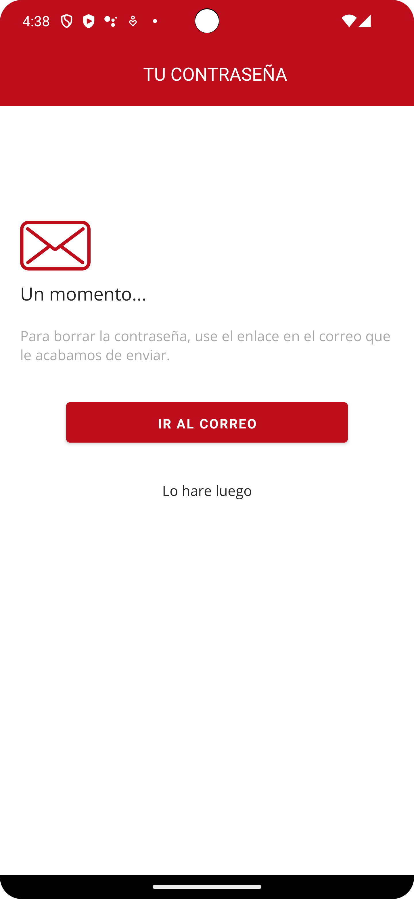

# MadridIndustria - Patrimonio Industrial de la Comunidad de Madrid

## FIGMA

## ESPAÑOL
MadridIndustria fomenta el interés en el patrimonio industrial de la Comunidad de Madrid. Con su interfaz intuitiva, explora y accede a información detallada sobre cada patrimonio, encuentra sitios históricos en el mapa, marca tus descubrimientos favoritos y organízalos en tu lista personal. Los gestores de patrimonios industriales pueden actualizar y gestionar la información, compartiendo datos relevantes para enriquecer la experiencia del usuario. ¡Descubre, aprende y preserva la historia industrial de Madrid con MadridIndustria!

### Ramas
- **Splash**: Rama responsable de la presentación del logo.
- **Index**: Rama responsable de MainActivity y sus respectivos.
- **Patrimonio**: Rama responsable de mostrar la información del patrimonio. 
- **Favorite**: Rama responsable de todo lo relacionado con Favorite.
- **Register**: Contiene la funcionalidad de la configuración del usuario.
- **Add**: Rama que gestiona la inserción de patrimonios por gestores.
- **Profile**: Rama para el perfil del usuario.

### Actividades
- **SplashActivity**: Logo con animaciones.
- **MainActivity**: Punto de entrada para explorar patrimonios industriales.
- **FirestoreDatabase**: Funciona como la base de datos central para almacenar información sobre patrimonios.
- **FirestoreCallback**: Interfaz esencial que permite la comunicación entre MainActivity y FirestoreDatabase, facilitando la obtención y actualización de datos sobre patrimonios.
- **PatrimonioActivity**: Esta actividad presenta la información relacionada con los patrimonios. Además, incluye funciones adicionales, como la posibilidad de agregar un patrimonio a la lista de favoritos.
- **Favorite**: Permite mostrar la lista de favoritos del usuario.
- **Perfilactivity**: Aparece iniciar sesión y registrarse.
- **LoginActivity**: Permite Aceder por correo, apple, facebook o el correo electronico que te registraste.
- **RegisterActivity**: Permite a los usuarios registrarse con la opción de iniciar sesion o registrarte
- **PasswordActivity**: Permite darte la opcion de enviarte la contraseña.
- **AddActivity**: Permite al usuario meter los datos.
- **ProfileActivity**: Permite eliminar la cuenta, cerrar sesión, cambiar de idioma y cambiar la contraseña.

### Capturas

 

### Video Demostrativo
[Splash](video/splash.webm)
[Main](video/main.webm)
[Patrimonio](video/patrimonio.webm)
[Favorite](video/favorite.webm)
[Login](video/login.webm)

### Estilo
Se personalizo la apariencia de la aplicación usando estilos y temas definidos en `res/values/styles.xml`.

### Contribuyendo
No dudes en contribuir a este proyecto creando solicitudes de extracción o informando problemas.

## ENGLISH
MadridIndustria promotes interest in the industrial heritage of the Community of Madrid. With its intuitive interface, explore and access detailed information about each heritage site, locate historic sites on the map, mark your favorite discoveries, and organize them in your personal list. Industrial heritage managers can update and manage information, sharing relevant data to enhance the user experience. Discover, learn, and preserve the industrial history of Madrid with MadridIndustria!

### Branches
- **Splash**: Branch responsible for the presentation of the logo.
- **Index**: Branch responsible for MainActivity and its related components.
- **Patrimonio**: Branch responsible for displaying heritage information.
- **Favorite**: Branch responsible for everything related to Favorite.
- **Register**: Contains the Hall functionality of starting or registering, Login allows you to log in in different ways, starting with your email and by chance you forgot the password, it goes to your email or else to the Hall.
- **Add**: Branch that manages the insertion of assets by managers.
- **Profile**: Branch for the user's profile.

### Activities
- **SplashActivity**: Logo with animations.
- **MainActivity**: Entry point for exploring industrial heritage.
- **FirestoreDatabase**: Functions as the central database for storing information about heritage sites.
- **FirestoreCallback**: Essential interface facilitating communication between MainActivity and FirestoreDatabase, enabling data retrieval and updates for heritage sites.
- **PatrimonioActivity**: This activity presents information related to heritage. In addition, it includes additional functions, such as the possibility of adding an estate to the favorites list.
- **Favorite**: Allows you to display the user's favorites list.
- **HallActivity**: Displays login and register options.
- **LoginActivity**: Allows logging in through email, Apple, Facebook, or the email used for registration.
- **RegisterActivity**: Allows users to register with the option to log in or register.
- **PasswordActivity**: Provides the option to send you the password
- **AddActivity**: Allows the user to enter the data.
- **ProfileActivity**: Allows you to delete the account, log out, change the language and change the password.

### Captures

 

 

### Demo Video
[Splash](video/splash.webm)
[Main](video/main.webm)
[Patrimonio](video/patrimonio.webm)
[Favorite](video/favorite.webm)
[Login](video/login.webm)

### Style
We've customized the appearance of the application using styles and themes defined in `res/values/styles.xml`. For more details, please review the code and comments in the corresponding activities.

### Contributing
Feel free to contribute to this project by creating pull requests or reporting issues.